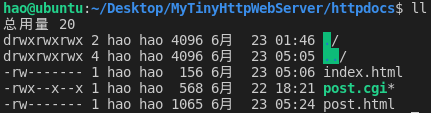
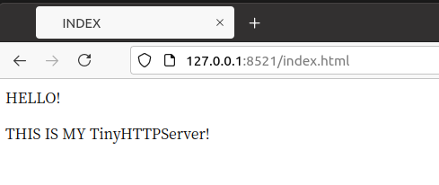
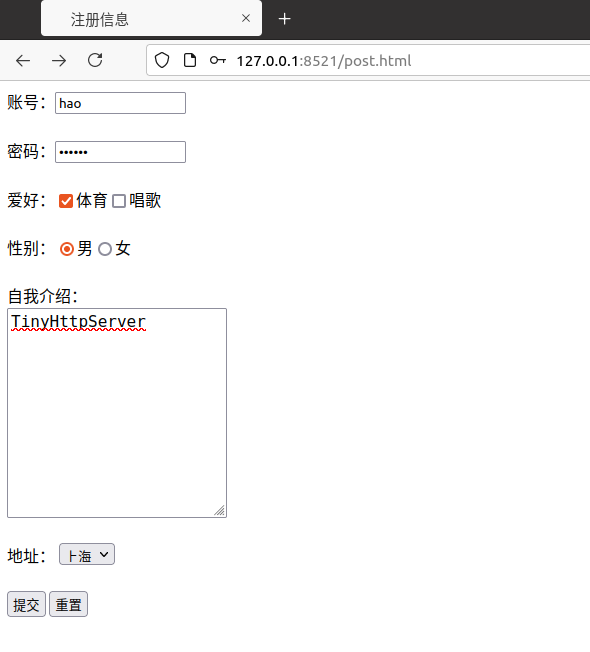
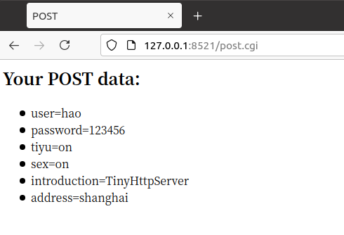

#### 一、赋予执行文件权限、编译及运行

1、post.html 以及 post.cgi需要权限才可以执行

```
cd  httpdocs

sudo chmod 600 index.html

sudo chmod 600 post.html

sudo chmod +x post.cgi
```

文件权限：



2、编译

```
cd  ../
make
```

3、运行

```
./myhttp
```

#### 二、运行效果








#### 三、整体框架图


#### 四、参考

https://www.cnblogs.com/qiyeboy/p/6296387.html

https://www.jianshu.com/p/18cfd6019296
